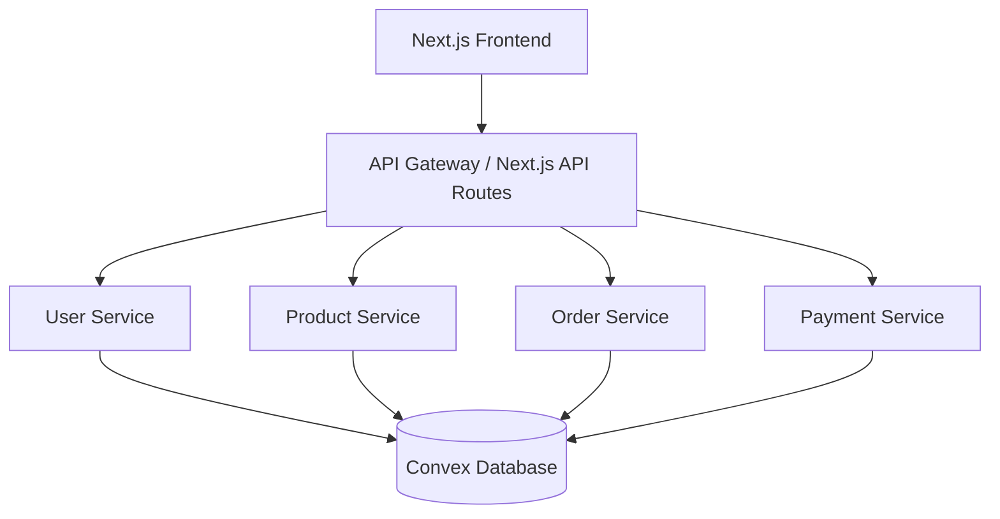

# E-Commerce Microservices Platform

This project demonstrates a scalable e-commerce platform built with a microservices architecture, utilizing Node.js, Docker, Convex, and Next.js.

## Architecture



## Services

- **User Service**: Handles authentication and user profiles.
- **Product Service**: Manages product catalog and inventory.
- **Order Service**: Processes orders and cart management.
- **Payment Service**: Handles transactions.

## Tech Stack

- **Frontend**: Next.js 14, Tailwind CSS, Lucide React
- **Backend Services**: Node.js, Express
- **Database**: Convex (Real-time, scalable)
- **Containerization**: Docker, Docker Compose
- **Deployment**: Vercel (Frontend), Docker Containers (Backend)

## Getting Started

### Prerequisites

- Node.js 18+
- Docker & Docker Compose
- Convex Account

### Setup

1.  **Install Dependencies**
    ```bash
    npm install
    ```

2.  **Initialize Convex**
    ```bash
    npx convex dev
    ```
    This will configure your Convex project and generate the necessary environment variables.

3.  **Start Microservices (Docker)**
    ```bash
    docker-compose up --build
    ```

4.  **Start Frontend**
    ```bash
    npm run dev:frontend
    ```
    Or access via Vercel deployment.

## APIs

The frontend proxies requests to services via `/api/[service]/[endpoint]`.

- `GET /api/products/products` -> Product Service
- `POST /api/users/register` -> User Service
